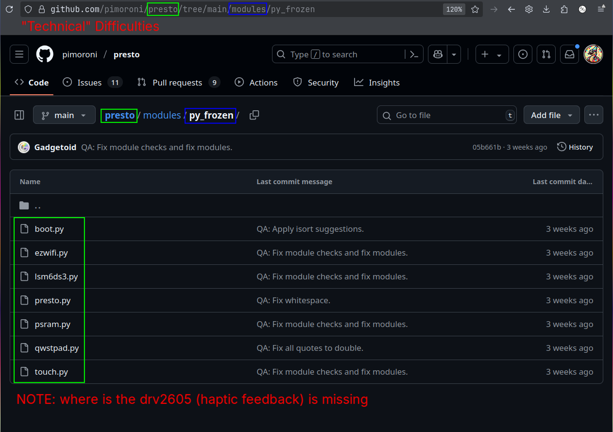

# README

# Todo 

- [x] [Preorder reference board - Pimoroni Presto](https://shop.pimoroni.com/products/presto?variant=54894104052091)
- [ ] [✨ Haptic feedback 📳](https://www.ti.com/lit/ds/symlink/drv2605.pdf)
- [ ] [✨ Spotify playback integration 🎵](https://www.ti.com/lit/ds/symlink/drv2605.pdf)

- [ ] [✨✨ Portable power/battery](https://shop.pimoroni.com/products/lipo-amigo?variant=39779302539347)

# Updating submodule

`git submodule update --remote firmware`

## 🧑‍💻 Difficulties

Sorry 👼, this is "struggle" with 📳 (haptic bzzzz 🤣)

Need to adapt/ask [this library](https://github.com/pimoroni/drv2605-python) for micropython env (RP2350) 🤔

UPDATE: I'm just an idiot 😒

Always 🇷🇺 , didn't 👀 [this link](https://github.com/pimoroni/pimoroni-pico#breakouts)

